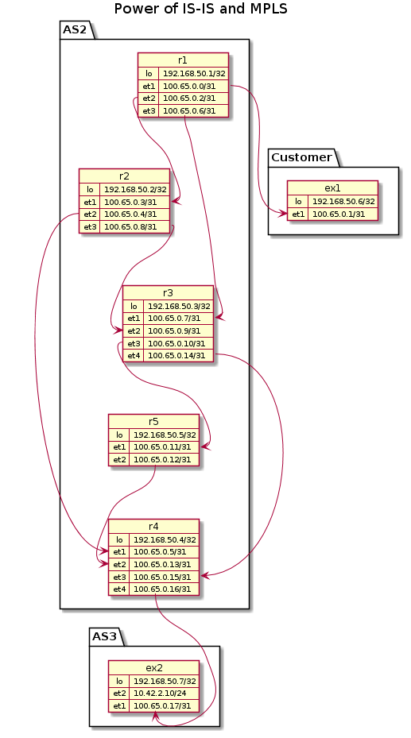
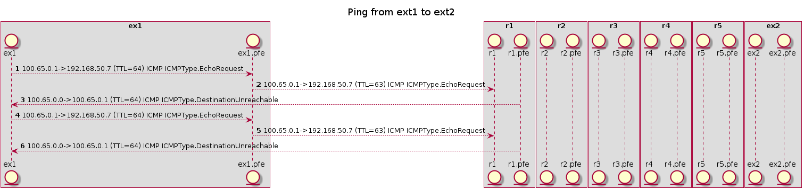
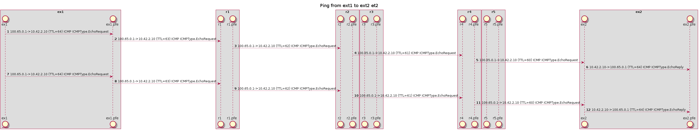
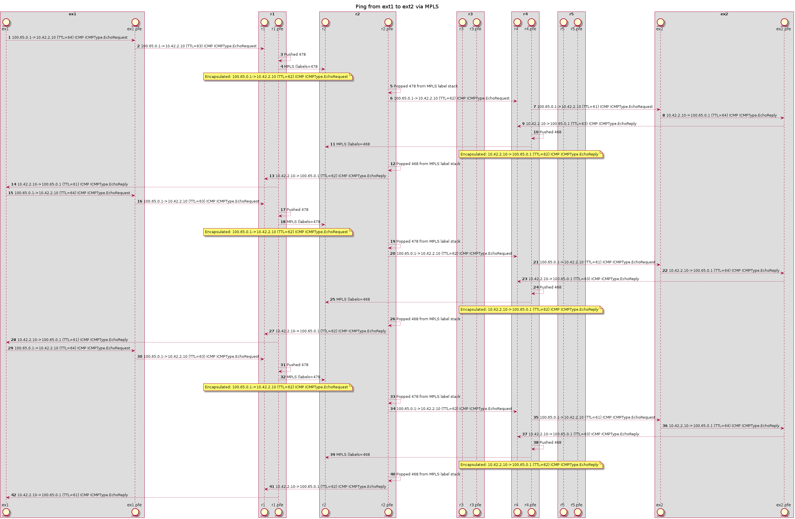
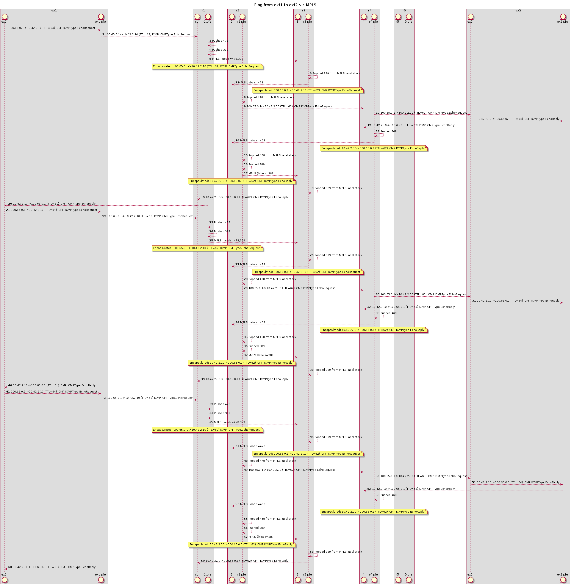

```python
from routersim.topology import Topology
from simhelpers import topology_object
from simhelpers import packet_sequence
from simhelpers import isis_sequence, rsvp_sequence
from routersim.routing import BGPRoute
from ipaddress import ip_network, ip_address
from IPython.display import Image
```

First we are going to generate a topology which represents some outside client, a backbone/provider network, as well as some "server" AS somewhere


```python
topology = Topology("Power of IS-IS and MPLS")


# Our service provider network
r1 = topology.add_router('r1', interfaces=['et1', 'et2', 'et3'], cluster_name='AS2')
r2 = topology.add_router('r2', interfaces=['et1', 'et2', 'et3'], cluster_name='AS2')
r3 = topology.add_router('r3', interfaces=['et1', 'et2', 'et3', 'et4'], cluster_name='AS2')
r4 = topology.add_router('r4', interfaces=['et1', 'et2', 'et3', 'et4'], cluster_name='AS2')
r5 = topology.add_router('r5', interfaces=['et1', 'et2', 'et3', 'et4'], cluster_name='AS2')
                         
# external system
ext1 = topology.add_router('ex1', interfaces=['et1'], cluster_name='Customer')

# Some other AS that customer wants to reach
ext2 = topology.add_router('ex2', interfaces=['et1', 'et2'], cluster_name='AS3')

# let's add another address on here
ext2.add_logical_interface(ext2.interfaces['et2'], 'et2.1', addresses={'ip': "10.42.2.10/24"})
ext2.interface('et2').up()
```

We now have some systems/routers, but they aren't connected together. Let's actually build up the links


```python
ext1_r1 = topology.link_router_pair(r1, ext1)

r1_r2 = topology.link_router_pair(r1, r2, latency_ms=50, te_metric=51)
r2_r4 = topology.link_router_pair(r2, r4, latency_ms=75, te_metric=77)


# A less desireable path
r1_r3 = topology.link_router_pair(r1, r3, latency_ms=120, te_metric=155)
r2_r3 = topology.link_router_pair(r2, r3, latency_ms=75, te_metric=91)
r3_r5 = topology.link_router_pair(r3, r5, latency_ms=50, te_metric=55)
r5_r4 = topology.link_router_pair(r5, r4, latency_ms=30, te_metric=35)
r3_r4 = topology.link_router_pair(r3, r4, latency_ms=110, te_metric=300)

ext2_r4 = topology.link_router_pair(r4, ext2)

displayrouters = [ext1]
displayrouters.extend([r1,r2,r3,r4,r5,ext2])
```


```python
display(Image(topology_object(topology.name, topology.get_topology()).png()))
```


    

    


Great, we have some servers and they are connected, but can they actually reach anything?


```python
ext1.ping(ext2.interface('et2.1').address().ip, count=2)
# Ticks are ms, so this represents about 2s
topology.run_another(2000)
```

    ex1 10.42.2.10 - No route to host!


    []


Ok, so we actually have no idea how to get there. Well, like we said ext1 is really just a customer of some provider. So let's add a static default route that goes through r1


```python
# Generally all actions are on the first logical interface
ext1.static_route("0.0.0.0/0", "et1.0")

ext1.ping(ext2.interface('lo.0').address().ip, count=2)
# Ticks are ms, so this represents about 2s
pingevents = topology.run_another(2000)
```

    PING 192.168.50.7
    	ICMP ICMPType.DestinationUnreachable from 100.65.0.0
    	ICMP ICMPType.DestinationUnreachable from 100.65.0.0


Progress of sorts, now the packet is just lost. Let's make sure we can get to the gateway


```python
ext1.ping(r1.interface('et1.0').address().ip, count=2)
events = topology.run_another(2000)
```

    PING 100.65.0.0
    	Received reply! ICMP ICMPType.EchoReply - 20 ms
    	Received reply! ICMP ICMPType.EchoReply - 20 ms


Great, so we know we can reach it. Perhaps we can see where it's getting lost


```python
display(Image(packet_sequence("Ping from ext1 to ext2", displayrouters, pingevents).png()))
```


    

    


Well, that makes sense. It is making it to R1, but R1 has no idea how to get all the way to ext2. 

It would make sense for the provider network to know how to reach ext2 via BGP. But can the provider systems even get to each other?


```python
r1.ping(r4.interface('lo.0').address().ip, count=2)
events = topology.run_another(2000)
```

    r1 192.168.50.4 - No route to host!


```python
r1.show_route_table()
```

    ### r1 routes ###
    inet.0
    
    100.65.0.0/31
    	[CONNECTED/1] to None via LOG/et1.0
    100.65.0.0/32
    	[LOCAL/1] to None via LOG/et1.0
    100.65.0.2/31
    	[CONNECTED/1] to None via LOG/et2.0
    100.65.0.2/32
    	[LOCAL/1] to None via LOG/et2.0
    100.65.0.6/31
    	[CONNECTED/1] to None via LOG/et3.0
    100.65.0.6/32
    	[LOCAL/1] to None via LOG/et3.0
    192.168.50.1/32
    	[LOCAL/1] to None via LOG/lo.0
    
    
    
    


Alas, no. So packet did make it to r1, but it doesn't know how to get anywhere.

We _could_ add a ton of static routes. But why do that when we can just fire up the IGP to establish connectitivity among all the servers in AS2


```python
topology.isis_enable_all('AS2')
topology.isis_start_all('AS2')


```


```python

# And then we'll give it a good 30s to converge
isis_events = topology.run_another(30000)
# we could display it, but it's sort of pointless to do so as there is so much going on
#display(Image(isis_sequence(
#        "Establish IGP",
#        topology.routers(),
#        isis_events).png()))
```

    r2 Invalid state: 1921.6805.0005 is not one of our neighbors
    r2 Invalid state: 1921.6805.0005 is not one of our neighbors
    r2 Invalid state: 1921.6805.0005 is not one of our neighbors


```python
r1.show_route_table()
```

    ### r1 routes ###
    inet.0
    
    100.65.0.0/31
    	[CONNECTED/1] to None via LOG/et1.0
    100.65.0.0/32
    	[LOCAL/1] to None via LOG/et1.0
    100.65.0.10/31
    	[ISIS/15] to 192.168.50.2/32 via LOG/et2.0
    100.65.0.12/31
    	[ISIS/15] to 192.168.50.2/32 via LOG/et2.0
    100.65.0.14/31
    	[ISIS/15] to 192.168.50.2/32 via LOG/et2.0
    100.65.0.2/31
    	[CONNECTED/1] to None via LOG/et2.0
    100.65.0.2/32
    	[LOCAL/1] to None via LOG/et2.0
    100.65.0.4/31
    	[ISIS/15] to 192.168.50.2/32 via LOG/et2.0
    100.65.0.6/31
    	[CONNECTED/1] to None via LOG/et3.0
    100.65.0.6/32
    	[LOCAL/1] to None via LOG/et3.0
    100.65.0.8/31
    	[ISIS/15] to 192.168.50.2/32 via LOG/et2.0
    192.168.50.1/32
    	[LOCAL/1] to None via LOG/lo.0
    192.168.50.2/32
    	[ISIS/15] to 192.168.50.2/32 via LOG/et2.0
    192.168.50.3/32
    	[ISIS/15] to 192.168.50.2/32 via LOG/et2.0
    192.168.50.4/32
    	[ISIS/15] to 192.168.50.2/32 via LOG/et2.0
    192.168.50.5/32
    	[ISIS/15] to 192.168.50.2/32 via LOG/et2.0
    
    
    
    


Now we're getting somewhere! We now have a route to each of the loopbacks, as well as some of the point to point networks. We should be able to ping r4 now


```python
r1.ping(r4.interface('lo.0').address().ip, count=2)
events = topology.run_another(2000)
```

    PING 192.168.50.4
    	Received reply! ICMP ICMPType.EchoReply - 250 ms
    	Received reply! ICMP ICMPType.EchoReply - 250 ms


Sure enough! And the time makes sense, (50+25)*2

Now we can add some "learned" BGP routes. We are assuming that r4 is what was AS3 is peered with, and that iBGP was used to distribute. As of now, I haven't actually implemented BGP route distribution, so we're going to do it manually.


```python
# The external peering
r4.routing.add_route(
    BGPRoute(
        ip_network("10.42.2.0/24"),
        None,  # we don't necessarily know the iface
        ip_address("10.10.10.10"),  #  This bit doesn't matter
        ['E'],
        ext2.interface('et1.0').address().ip,  # we received it on the point-to-point between r4 and ext2
    ),
    'bgp'
)

# The iBGP
ibgproute = BGPRoute(
        ip_network("10.42.2.0/24"),
        None,  # we don't necessarily know the iface
        ip_address("10.10.10.10"),  #  This bit doesn't matter
        ['I'],
        r4.interface('lo.0').address().ip  # we are pretending that r4 originated it
    )

for r in [r1,r2,r3,r5]:
    r.routing.add_route(ibgproute, 'bgp')
```


```python
r1.show_route_table()
```

    ### r1 routes ###
    inet.0
    
    10.42.2.0/24
    	[BGP/170] (pnh: 192.168.50.4) to 10.10.10.10 via LOG/et2.0
    100.65.0.0/31
    	[CONNECTED/1] to None via LOG/et1.0
    100.65.0.0/32
    	[LOCAL/1] to None via LOG/et1.0
    100.65.0.10/31
    	[ISIS/15] to 192.168.50.2/32 via LOG/et2.0
    100.65.0.12/31
    	[ISIS/15] to 192.168.50.2/32 via LOG/et2.0
    100.65.0.14/31
    	[ISIS/15] to 192.168.50.2/32 via LOG/et2.0
    100.65.0.2/31
    	[CONNECTED/1] to None via LOG/et2.0
    100.65.0.2/32
    	[LOCAL/1] to None via LOG/et2.0
    100.65.0.4/31
    	[ISIS/15] to 192.168.50.2/32 via LOG/et2.0
    100.65.0.6/31
    	[CONNECTED/1] to None via LOG/et3.0
    100.65.0.6/32
    	[LOCAL/1] to None via LOG/et3.0
    100.65.0.8/31
    	[ISIS/15] to 192.168.50.2/32 via LOG/et2.0
    192.168.50.1/32
    	[LOCAL/1] to None via LOG/lo.0
    192.168.50.2/32
    	[ISIS/15] to 192.168.50.2/32 via LOG/et2.0
    192.168.50.3/32
    	[ISIS/15] to 192.168.50.2/32 via LOG/et2.0
    192.168.50.4/32
    	[ISIS/15] to 192.168.50.2/32 via LOG/et2.0
    192.168.50.5/32
    	[ISIS/15] to 192.168.50.2/32 via LOG/et2.0
    
    
    
    


Great! You can see here:
`10.42.2.0/24
	[BGP/170] (pnh: 192.168.50.4) to 10.10.10.10 via LOG/et2.0`

That r1 now knows how to get to that prefix, and it has 192.168.50.4, the loopback of r4. 
Can we ping now?


```python
ext1.ping(ext2.interface('et2.1').address().ip, count=2)
# Ticks are ms, so this represents about 2s
pingevents = topology.run_another(2000)
```

    PING 10.42.2.10
    	!! Lost after 1000ms
    	!! Lost after 1000ms


Hm, no. But we also didn't get an "unreachable" message. Let's take a look


```python
display(Image(packet_sequence("Ping from ext1 to ext2 et2", displayrouters, pingevents).png()))
```


    

    


Ok, so its perhaps not super clear, but what you may be able to see here is that the message *is* making it to ext2, but ext2 doesn't actually know how to get all the way back to ext1.

We're going to add 2 more additional routes:
1. A default route on ext2 that goes through r4 (let's assume again that AS2 is their transit provider and ISP)
2. A BGP route for the point-to-point interface between ext1 and r1. 

The last is something we could have injected into the IGP, but we want to keep the IGP clean. We happen to be using a point-to-point IP there, but it could have been another totally different address space


```python
# The iBGP
ibgproute = BGPRoute(
        ext1.interface('et1.0').address().network,
        None,  # we don't necessarily know the iface
        ip_address("10.10.10.10"),  #  This bit doesn't matter
        ['I'],
        r1.interface('lo.0').address().ip  # we are pretending that r1 originated it
    )

for r in [r2,r3,r4,r5]:
    r.routing.add_route(ibgproute, 'bgp')
    

```


```python
ext2.static_route('0.0.0.0/0', ext2.interface('et1.0'))
```


```python
ext1.ping(ext2.interface('et2.1').address().ip, count=2)
# Ticks are ms, so this represents about 2s
pingevents = topology.run_another(2000)
```

    PING 10.42.2.10
    	Received reply! ICMP ICMPType.EchoReply - 290 ms
    	Received reply! ICMP ICMPType.EchoReply - 290 ms


Awesome! We have no traversed the transit network to AS3. Let's take a look at a couple of those routes


```python
ext1.show_route_table()
```

    ### ex1 routes ###
    inet.0
    
    0.0.0.0/0
    	[STATIC/5] to None via LOG/et1.0
    100.65.0.0/31
    	[CONNECTED/1] to None via LOG/et1.0
    100.65.0.1/32
    	[LOCAL/1] to None via LOG/et1.0
    192.168.50.6/32
    	[LOCAL/1] to None via LOG/lo.0
    
    
    
    


```python
r4.show_route_table()
```

    ### r4 routes ###
    inet.0
    
    10.42.2.0/24
    	[BGP/170] (pnh: 100.65.0.17) to 10.10.10.10 via LOG/et4.0
    100.65.0.0/31
    	[BGP/170] (pnh: 192.168.50.1) to 10.10.10.10 via LOG/et1.0
    100.65.0.10/31
    	[ISIS/15] to 192.168.50.5/32 via LOG/et2.0
    100.65.0.12/31
    	[CONNECTED/1] to None via LOG/et2.0
    100.65.0.13/32
    	[LOCAL/1] to None via LOG/et2.0
    100.65.0.14/31
    	[CONNECTED/1] to None via LOG/et3.0
    100.65.0.15/32
    	[LOCAL/1] to None via LOG/et3.0
    100.65.0.16/31
    	[CONNECTED/1] to None via LOG/et4.0
    100.65.0.16/32
    	[LOCAL/1] to None via LOG/et4.0
    100.65.0.2/31
    	[ISIS/15] to 192.168.50.2/32 via LOG/et1.0
    100.65.0.4/31
    	[CONNECTED/1] to None via LOG/et1.0
    100.65.0.5/32
    	[LOCAL/1] to None via LOG/et1.0
    100.65.0.6/31
    	[ISIS/15] to 192.168.50.5/32 via LOG/et2.0
    100.65.0.8/31
    	[ISIS/15] to 192.168.50.2/32 via LOG/et1.0
    192.168.50.1/32
    	[ISIS/15] to 192.168.50.2/32 via LOG/et1.0
    192.168.50.2/32
    	[ISIS/15] to 192.168.50.2/32 via LOG/et1.0
    192.168.50.3/32
    	[ISIS/15] to 192.168.50.5/32 via LOG/et2.0
    192.168.50.4/32
    	[LOCAL/1] to None via LOG/lo.0
    192.168.50.5/32
    	[ISIS/15] to 192.168.50.5/32 via LOG/et2.0
    
    
    
    


Don't mind those bugs where some routes are showing multiple times!

Now, what happens if we were to lose the connection between r1 and r2?


```python
#r2_r4.down()
r1_r2.down()

ext1.ping(ext2.interface('et2.1').address().ip, count=10)
# Ticks are ms, so this represents about 2s
pingevents = topology.run_another(15000)
```

    PING 10.42.2.10
    	ICMP ICMPType.DestinationUnreachable from 100.65.0.0
    	ICMP ICMPType.DestinationUnreachable from 100.65.0.0
    	ICMP ICMPType.DestinationUnreachable from 100.65.0.0
    	ICMP ICMPType.DestinationUnreachable from 100.65.0.0
    	ICMP ICMPType.DestinationUnreachable from 100.65.0.0
    	ICMP ICMPType.DestinationUnreachable from 100.65.0.0
    	ICMP ICMPType.DestinationUnreachable from 100.65.0.0
    	ICMP ICMPType.DestinationUnreachable from 100.65.0.0
    	ICMP ICMPType.DestinationUnreachable from 100.65.0.0
    	ICMP ICMPType.DestinationUnreachable from 100.65.0.0


```python
r1_r2.up()
#display(Image(isis_sequence(
#        "Establish IGP",
#        topology.routers(),
#        pingevents).png()))
```

So in real life IS-IS should have re-converged after a bit and packets would have started taking another route. So just pretend that happened. But we don't want multiple seconds of packet loss any way. 

This is where having pre-established label-switched-pats with bypasses comes into play.

Let's build that up real quick


```python
# We are creating a specific path between r1 to r4, and requesting that links along the way are protected
r1.create_lsp('r1-to-r4', r4.interface('lo.0').address().ip, link_protection=True)

# we are also creating a path going backwards, but not requesting link protection (due to some bugs)
r4.create_lsp('r4-to-r1', r1.interface('lo.0').address().ip, link_protection=True)
```


```python
topology.rsvp_start_all(cluster_name='AS2')
```


```python
# Give that some time to do its thing
rsvpevents = topology.run_another(5000)
```


```python
display(Image(rsvp_sequence(
        "Establish RSVP",
        topology.routers(),
        rsvpevents).png()))
```


    

    


```python
r1.show_route_table()
```

    ### r1 routes ###
    inet.0
    
    10.42.2.0/24
    	[BGP/170] to 100.65.0.3 via LOG/et2.0, label-switched-path r1-to-r4
    	[BGP/170] to 100.65.0.7 via LOG/et3.0, label-switched-path Bypass->100.65.0.3 (r1)
    100.65.0.0/31
    	[CONNECTED/1] to None via LOG/et1.0
    100.65.0.0/32
    	[LOCAL/1] to None via LOG/et1.0
    100.65.0.10/31
    	[ISIS/15] to 192.168.50.2/32 via LOG/et2.0
    100.65.0.12/31
    	[ISIS/15] to 192.168.50.2/32 via LOG/et2.0
    100.65.0.14/31
    	[ISIS/15] to 192.168.50.2/32 via LOG/et2.0
    100.65.0.2/31
    	[CONNECTED/1] to None via LOG/et2.0
    100.65.0.2/32
    	[LOCAL/1] to None via LOG/et2.0
    100.65.0.4/31
    	[ISIS/15] to 192.168.50.2/32 via LOG/et2.0
    100.65.0.6/31
    	[CONNECTED/1] to None via LOG/et3.0
    100.65.0.6/32
    	[LOCAL/1] to None via LOG/et3.0
    100.65.0.8/31
    	[ISIS/15] to 192.168.50.2/32 via LOG/et2.0
    192.168.50.1/32
    	[LOCAL/1] to None via LOG/lo.0
    192.168.50.2/32
    	[ISIS/15] to 192.168.50.2/32 via LOG/et2.0
    192.168.50.3/32
    	[ISIS/15] to 192.168.50.2/32 via LOG/et2.0
    192.168.50.4/32
    	[ISIS/15] to 192.168.50.2/32 via LOG/et2.0
    192.168.50.5/32
    	[ISIS/15] to 192.168.50.2/32 via LOG/et2.0
    
    
    
    inet.3
    
    192.168.50.4/32
    	[RSVP/7] to 100.65.0.3 via LOG/et2.0, label-switched-path r1-to-r4, Push 478
    
    
    
    


```python
ext1.ping(ext2.interface('et2.1').address().ip, count=3)
# Ticks are ms, so this represents about 2s
pingevents = topology.run_another(15000)
```

    PING 10.42.2.10
    	Received reply! ICMP ICMPType.EchoReply - 290 ms
    	Received reply! ICMP ICMPType.EchoReply - 290 ms
    	Received reply! ICMP ICMPType.EchoReply - 290 ms


```python
display(Image(packet_sequence("Ping from ext1 to ext2 via MPLS", displayrouters, pingevents).png()))
```


    

    


```python
#r1_r2.down()
#ext1.ping(ext2.interface('et2.1').address().ip, count=10)
# Ticks are ms, so this represents about 2s
#pingevents = topology.run_another(15000)
```


```python
r4.show_route_table()
```

    ### r4 routes ###
    inet.0
    
    10.42.2.0/24
    	[BGP/170] (pnh: 100.65.0.17) to 10.10.10.10 via LOG/et4.0
    100.65.0.0/31
    	[BGP/170] to 100.65.0.4 via LOG/et1.0, label-switched-path r4-to-r1
    	[BGP/170] to 100.65.0.12 via LOG/et2.0, label-switched-path Bypass->100.65.0.4 (r4)
    100.65.0.10/31
    	[ISIS/15] to 192.168.50.5/32 via LOG/et2.0
    100.65.0.12/31
    	[CONNECTED/1] to None via LOG/et2.0
    100.65.0.13/32
    	[LOCAL/1] to None via LOG/et2.0
    100.65.0.14/31
    	[CONNECTED/1] to None via LOG/et3.0
    100.65.0.15/32
    	[LOCAL/1] to None via LOG/et3.0
    100.65.0.16/31
    	[CONNECTED/1] to None via LOG/et4.0
    100.65.0.16/32
    	[LOCAL/1] to None via LOG/et4.0
    100.65.0.2/31
    	[ISIS/15] to 192.168.50.2/32 via LOG/et1.0
    100.65.0.4/31
    	[CONNECTED/1] to None via LOG/et1.0
    100.65.0.5/32
    	[LOCAL/1] to None via LOG/et1.0
    100.65.0.6/31
    	[ISIS/15] to 192.168.50.5/32 via LOG/et2.0
    100.65.0.8/31
    	[ISIS/15] to 192.168.50.2/32 via LOG/et1.0
    192.168.50.1/32
    	[ISIS/15] to 192.168.50.2/32 via LOG/et1.0
    192.168.50.2/32
    	[ISIS/15] to 192.168.50.2/32 via LOG/et1.0
    192.168.50.3/32
    	[ISIS/15] to 192.168.50.5/32 via LOG/et2.0
    192.168.50.4/32
    	[LOCAL/1] to None via LOG/lo.0
    192.168.50.5/32
    	[ISIS/15] to 192.168.50.5/32 via LOG/et2.0
    
    
    
    inet.3
    
    192.168.50.1/32
    	[RSVP/7] to 100.65.0.4 via LOG/et1.0, label-switched-path r4-to-r1, Push 468
    
    
    
    mpls.3
    
    212
    	[RSVP/7] to 100.65.0.12 via LOG/et2.0, label-switched-path Bypass->100.65.0.11 (r3), Pop
    222
    	[RSVP/7] to 100.65.0.4 via LOG/et1.0, label-switched-path Bypass->100.65.0.8 (r3), Pop
    232
    	[RSVP/7] to 100.65.0.12 via LOG/et2.0, label-switched-path Bypass->100.65.0.9 (r2), Swap in 168
    242
    	[RSVP/7] to 100.65.0.4 via LOG/et1.0, label-switched-path Bypass->100.65.0.10 (r5), Swap in 518
    


```python
r2.show_route_table()
```

    ### r2 routes ###
    inet.0
    
    10.42.2.0/24
    	[BGP/170] (pnh: 192.168.50.4) to 10.10.10.10 via LOG/et2.0
    100.65.0.0/31
    	[BGP/170] (pnh: 192.168.50.1) to 10.10.10.10 via LOG/et1.0
    100.65.0.10/31
    	[ISIS/15] to 192.168.50.3/32 via LOG/et3.0
    100.65.0.12/31
    	[ISIS/15] to 192.168.50.4/32 via LOG/et2.0
    100.65.0.14/31
    	[ISIS/15] to 192.168.50.4/32 via LOG/et2.0
    100.65.0.2/31
    	[CONNECTED/1] to None via LOG/et1.0
    100.65.0.3/32
    	[LOCAL/1] to None via LOG/et1.0
    100.65.0.4/31
    	[CONNECTED/1] to None via LOG/et2.0
    100.65.0.4/32
    	[LOCAL/1] to None via LOG/et2.0
    100.65.0.6/31
    	[ISIS/15] to 192.168.50.1/32 via LOG/et1.0
    100.65.0.8/31
    	[CONNECTED/1] to None via LOG/et3.0
    100.65.0.8/32
    	[LOCAL/1] to None via LOG/et3.0
    192.168.50.1/32
    	[ISIS/15] to 192.168.50.1/32 via LOG/et1.0
    192.168.50.2/32
    	[LOCAL/1] to None via LOG/lo.0
    192.168.50.3/32
    	[ISIS/15] to 192.168.50.3/32 via LOG/et3.0
    192.168.50.4/32
    	[ISIS/15] to 192.168.50.4/32 via LOG/et2.0
    192.168.50.5/32
    	[ISIS/15] to 192.168.50.4/32 via LOG/et2.0
    
    
    
    mpls.3
    
    468
    	[RSVP/7] to 100.65.0.2 via LOG/et1.0, label-switched-path r4-to-r1, Pop
    478
    	[RSVP/7] to 100.65.0.5 via LOG/et2.0, label-switched-path r1-to-r4, Pop
    488
    	[RSVP/7] to 100.65.0.5 via LOG/et2.0, label-switched-path Bypass->100.65.0.13 (r5), Pop
    498
    	[RSVP/7] to 100.65.0.2 via LOG/et1.0, label-switched-path Bypass->100.65.0.6 (r3), Pop
    508
    	[RSVP/7] to 100.65.0.5 via LOG/et2.0, label-switched-path Bypass->100.65.0.11 (r3), Swap in 212
    518
    	[RSVP/7] to 100.65.0.9 via LOG/et3.0, label-switched-path Bypass->100.65.0.10 (r5), Pop
    528
    	[RSVP/7] to 100.65.0.9 via LOG/et3.0, label-switched-path Bypass->100.65.0.7 (r1), Pop
    538
    	[RSVP/7] to 100.65.0.9 via LOG/et3.0, label-switched-path Bypass->100.65.0.12 (r4), Swap in 419
    


```python
r1_r2.down()
ext1.ping(ext2.interface('et2.1').address().ip, count=3)
# Ticks are ms, so this represents about 2s
pingevents = topology.run_another(4000)
```

    PING 10.42.2.10
    	Received reply! ICMP ICMPType.EchoReply - 580 ms
    	Received reply! ICMP ICMPType.EchoReply - 580 ms
    	Received reply! ICMP ICMPType.EchoReply - 580 ms


```python

display(Image(packet_sequence("Ping from ext1 to ext2 via MPLS", displayrouters, pingevents).png()))
#r2_r4.down()
#ext1.ping(ext2.interface('et2.1').address().ip, count=10)
# Ticks are ms, so this represents about 2s
#pingevents = topology.run_another(15000)
```


    

    


```python
r1.show_isis_database()
```

    LSP r1(1921.6805.0001).00,seq=8
    	Dynamic Hostname(137)
    		IP router id: 192.168.50.1
    	Extended IP: 192.168.50.1/32 metric=500 state=UP
    	Extended IP: 100.65.0.2/31 metric=51 state=DOWN
    	Extended neighbor: 1921.6805.0003 metric=155
    			IP Address: 100.65.0.6 (UP)
    			Neighbor IP Address: 100.65.0.7
    	Extended IP: 100.65.0.6/31 metric=155 state=UP
    	Extended neighbor: 1921.6805.0002 metric=51
    			IP Address: 100.65.0.2 (DOWN)
    			Neighbor IP Address: 100.65.0.3
    LSP r2(1921.6805.0002).00,seq=5
    	Dynamic Hostname(137)
    		IP router id: 192.168.50.2
    	Extended IP: 192.168.50.2/32 metric=500 state=UP
    	Extended IP: 100.65.0.2/31 metric=51 state=DOWN
    	Extended neighbor: 1921.6805.0004 metric=77
    			IP Address: 100.65.0.4 (UP)
    			Neighbor IP Address: 100.65.0.5
    	Extended IP: 100.65.0.4/31 metric=77 state=UP
    	Extended neighbor: 1921.6805.0003 metric=91
    			IP Address: 100.65.0.8 (UP)
    			Neighbor IP Address: 100.65.0.9
    	Extended IP: 100.65.0.8/31 metric=91 state=UP
    	Extended neighbor: 1921.6805.0001 metric=51
    			IP Address: 100.65.0.3 (DOWN)
    			Neighbor IP Address: 100.65.0.2
    LSP r3(1921.6805.0003).00,seq=2
    	Dynamic Hostname(137)
    		IP router id: 192.168.50.3
    	Extended IP: 192.168.50.3/32 metric=500 state=UP
    	Extended neighbor: 1921.6805.0001 metric=155
    			IP Address: 100.65.0.7 (UP)
    			Neighbor IP Address: 100.65.0.6
    	Extended IP: 100.65.0.6/31 metric=155 state=UP
    	Extended neighbor: 1921.6805.0002 metric=91
    			IP Address: 100.65.0.9 (UP)
    			Neighbor IP Address: 100.65.0.8
    	Extended IP: 100.65.0.8/31 metric=91 state=UP
    	Extended neighbor: 1921.6805.0005 metric=55
    			IP Address: 100.65.0.10 (UP)
    			Neighbor IP Address: 100.65.0.11
    	Extended IP: 100.65.0.10/31 metric=55 state=UP
    	Extended neighbor: 1921.6805.0004 metric=300
    			IP Address: 100.65.0.14 (UP)
    			Neighbor IP Address: 100.65.0.15
    	Extended IP: 100.65.0.14/31 metric=300 state=UP
    LSP r5(1921.6805.0005).00,seq=2
    	Dynamic Hostname(137)
    		IP router id: 192.168.50.5
    	Extended IP: 192.168.50.5/32 metric=500 state=UP
    	Extended neighbor: 1921.6805.0003 metric=55
    			IP Address: 100.65.0.11 (UP)
    			Neighbor IP Address: 100.65.0.10
    	Extended IP: 100.65.0.10/31 metric=55 state=UP
    	Extended neighbor: 1921.6805.0004 metric=35
    			IP Address: 100.65.0.12 (UP)
    			Neighbor IP Address: 100.65.0.13
    	Extended IP: 100.65.0.12/31 metric=35 state=UP
    LSP r4(1921.6805.0004).00,seq=1
    	Dynamic Hostname(137)
    		IP router id: 192.168.50.4
    	Extended IP: 192.168.50.4/32 metric=500 state=UP
    	Extended neighbor: 1921.6805.0002 metric=77
    			IP Address: 100.65.0.5 (UP)
    			Neighbor IP Address: 100.65.0.4
    	Extended IP: 100.65.0.4/31 metric=77 state=UP
    	Extended neighbor: 1921.6805.0005 metric=35
    			IP Address: 100.65.0.13 (UP)
    			Neighbor IP Address: 100.65.0.12
    	Extended IP: 100.65.0.12/31 metric=35 state=UP
    	Extended neighbor: 1921.6805.0003 metric=300
    			IP Address: 100.65.0.15 (UP)
    			Neighbor IP Address: 100.65.0.14
    	Extended IP: 100.65.0.14/31 metric=300 state=UP


```python
r4.show_isis_database()
```

    LSP r4(1921.6805.0004).00,seq=1
    	Dynamic Hostname(137)
    		IP router id: 192.168.50.4
    	Extended IP: 192.168.50.4/32 metric=500 state=UP
    	Extended neighbor: 1921.6805.0002 metric=77
    			IP Address: 100.65.0.5 (UP)
    			Neighbor IP Address: 100.65.0.4
    	Extended IP: 100.65.0.4/31 metric=77 state=UP
    	Extended neighbor: 1921.6805.0005 metric=35
    			IP Address: 100.65.0.13 (UP)
    			Neighbor IP Address: 100.65.0.12
    	Extended IP: 100.65.0.12/31 metric=35 state=UP
    	Extended neighbor: 1921.6805.0003 metric=300
    			IP Address: 100.65.0.15 (UP)
    			Neighbor IP Address: 100.65.0.14
    	Extended IP: 100.65.0.14/31 metric=300 state=UP
    LSP r5(1921.6805.0005).00,seq=2
    	Dynamic Hostname(137)
    		IP router id: 192.168.50.5
    	Extended IP: 192.168.50.5/32 metric=500 state=UP
    	Extended neighbor: 1921.6805.0003 metric=55
    			IP Address: 100.65.0.11 (UP)
    			Neighbor IP Address: 100.65.0.10
    	Extended IP: 100.65.0.10/31 metric=55 state=UP
    	Extended neighbor: 1921.6805.0004 metric=35
    			IP Address: 100.65.0.12 (UP)
    			Neighbor IP Address: 100.65.0.13
    	Extended IP: 100.65.0.12/31 metric=35 state=UP
    LSP r2(1921.6805.0002).00,seq=5
    	Dynamic Hostname(137)
    		IP router id: 192.168.50.2
    	Extended IP: 192.168.50.2/32 metric=500 state=UP
    	Extended IP: 100.65.0.2/31 metric=51 state=DOWN
    	Extended neighbor: 1921.6805.0004 metric=77
    			IP Address: 100.65.0.4 (UP)
    			Neighbor IP Address: 100.65.0.5
    	Extended IP: 100.65.0.4/31 metric=77 state=UP
    	Extended neighbor: 1921.6805.0003 metric=91
    			IP Address: 100.65.0.8 (UP)
    			Neighbor IP Address: 100.65.0.9
    	Extended IP: 100.65.0.8/31 metric=91 state=UP
    	Extended neighbor: 1921.6805.0001 metric=51
    			IP Address: 100.65.0.3 (DOWN)
    			Neighbor IP Address: 100.65.0.2
    LSP r3(1921.6805.0003).00,seq=2
    	Dynamic Hostname(137)
    		IP router id: 192.168.50.3
    	Extended IP: 192.168.50.3/32 metric=500 state=UP
    	Extended neighbor: 1921.6805.0001 metric=155
    			IP Address: 100.65.0.7 (UP)
    			Neighbor IP Address: 100.65.0.6
    	Extended IP: 100.65.0.6/31 metric=155 state=UP
    	Extended neighbor: 1921.6805.0002 metric=91
    			IP Address: 100.65.0.9 (UP)
    			Neighbor IP Address: 100.65.0.8
    	Extended IP: 100.65.0.8/31 metric=91 state=UP
    	Extended neighbor: 1921.6805.0005 metric=55
    			IP Address: 100.65.0.10 (UP)
    			Neighbor IP Address: 100.65.0.11
    	Extended IP: 100.65.0.10/31 metric=55 state=UP
    	Extended neighbor: 1921.6805.0004 metric=300
    			IP Address: 100.65.0.14 (UP)
    			Neighbor IP Address: 100.65.0.15
    	Extended IP: 100.65.0.14/31 metric=300 state=UP
    LSP r1(1921.6805.0001).00,seq=8
    	Dynamic Hostname(137)
    		IP router id: 192.168.50.1
    	Extended IP: 192.168.50.1/32 metric=500 state=UP
    	Extended IP: 100.65.0.2/31 metric=51 state=DOWN
    	Extended neighbor: 1921.6805.0003 metric=155
    			IP Address: 100.65.0.6 (UP)
    			Neighbor IP Address: 100.65.0.7
    	Extended IP: 100.65.0.6/31 metric=155 state=UP
    	Extended neighbor: 1921.6805.0002 metric=51
    			IP Address: 100.65.0.2 (DOWN)
    			Neighbor IP Address: 100.65.0.3


Bugs! So the bypass is actually being taken (r2->r3), but as the LSP on the other side (r4->r1) wasn't established, r4 no longer knows how to get there. And IS-IS hasn't converged


```python

```


```python

```
